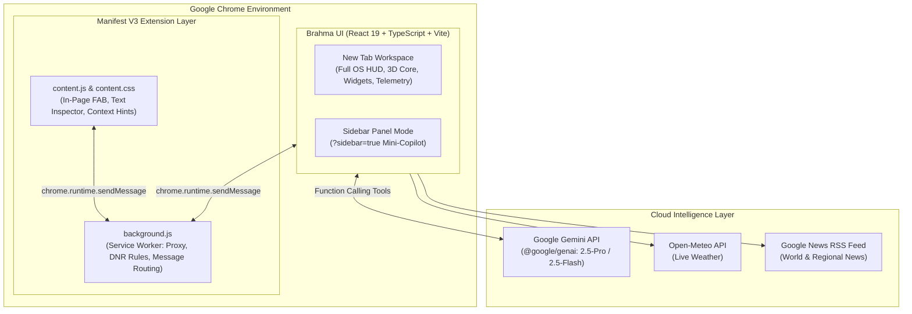

<div align="center">

# ⚡ Brahma - Modular Chrome OS
### *The Next-Generation Modular AI Browser Operating System & Extension*

[](LICENSE)
[](manifest.json)
[](https://react.dev/)
[](https://www.typescriptlang.org/)
[](https://vitejs.dev/)
[](https://tailwindcss.com/)
[](https://ai.google.dev/)

<br />

> **Brahma - Modular Chrome OS** transforms your browser into an intelligent, cyberpunk-styled HUD and autonomous AI workspace. Built with an Opera GX / Raycast spatial aesthetic, it integrates real-time Gemini function-calling agents, mode-driven workflow isolation, a distraction shield firewall, spatial 3D computer-vision hand tracking, and an ambient in-page copilot.

<br />

[Features](#-key-features) • [Architecture](#-architecture) • [Getting Started](#-getting-started) • [Extension Setup](#-installing-the-chrome-extension) • [Keyboard Shortcuts](#-keyboard-shortcuts) • [License](#-license)

---

</div>

<br />

## 🌟 Key Features

### 🧠 1. Tri-Mode Contextual Workspace
Switch seamlessly between purpose-tailored environments that adapt themes, shortcuts, suggestions, and focus rules:
* **📘 Study Mode (`#59d7ff`)**: Deep focus environment. Automatically suppresses distracting domains (YouTube, TikTok, Netflix), generates flashcards, quizzes, and TL;DR research summaries.
* **🎮 Gaming Mode (`#ff4fd8`)**: Neon cyberpunk command deck. Instant access to guides, Twitch, Discord, patch notes, and gaming portals.
* **💻 Developer Mode (`#2ef2d0`)**: High-contrast matrix grid. Integrated code debugger, terminal snippets, API test utilities, and StackOverflow/GitHub quick queries.

---

### 🤖 2. Autonomous Brahma AI Agent
Powered by **Google Gemini 2.5 Pro** (with automatic quota fallback to **Gemini 2.5 Flash**) using **Function Calling**:
* `switchMode`: Intelligently reconfigures the environment based on natural intent.
* `openShortcut`: Launches websites and web applications directly.
* `searchWeb`: Conducts search lookups and synthesizes findings.
* `executeAutomation`: Plans and runs multi-step browser automations sequentially.
* `summarizePage`: Extracts structured summaries from current or provided URLs.
* `getWeather`, `openNewTab`, `closeCurrentTab`, `navigateTo`, `goBack`, `goForward`.
* Full voice interface using the **Web Speech API** for hands-free audio queries.

---

### 🛡️ 3. Brahma Shield (Focus Firewall & Proxy Engine)
* Enforces distraction blocking via Chrome's `declarativeNetRequest` session rule engine.
* Integrated proxy router with fail-open safeguards and exit-node IP geolocation inspection.
* Automatically triggers dynamic focus alerts and workspace blur if distraction triggers occur.

---

### 🌐 4. Ubiquitous In-Page Copilot (Content Script)
* Non-intrusive floating action button (**FAB**) injected into visited web pages.
* Context-aware URL detection (YouTube video summarizer, GitHub repo explainer, Wikipedia notes generator).
* Instant text selection menu: Highlight text on any website to summarize, explain, or capture into your persistent Notes Vault.

---

### 🔮 5. Spatial 3D Holographic Core (WebGL + Computer Vision)
* Three.js 3D orb with multi-ring particle geometry, custom GLSL chromatic aberration, and `UnrealBloomPass` post-processing.
* Real-time **MediaPipe AI Hand Tracking** (`@mediapipe/tasks-vision`) running on GPU/WASM:
  * **Pinch + Drag**: Rotates the holographic core in 3D space.
  * **Two-Hand Pinch + Spread**: Zooms in and out dynamically.

---

### ⏱️ 6. Spatial-Glass HUD & Widgets
* **Hardware-Accelerated Analog Dial**: 60fps requestAnimationFrame fluid timepiece with digital AM/PM, millisecond precision, and dynamic mode glow.
* **System Telemetry**: Live battery status (`navigator.getBattery`), memory heap gauge (`performance.memory`), and live weather.
* **Dual Live RSS News Feed**: Filtered global and regional news briefing side-panel with zero third-party tracking.

<br />

---

## 🏗️ Architecture



<br />

---

## 📁 Repository Structure

```
Brahma-Modular-Chrome-OS/
├── public/
│   ├── content.js              # In-page assistant content script (FAB, hints)
│   ├── content.css             # In-page styling
│   └── favicon.svg             # Brahma logo
├── src/
│   ├── components/
│   │   ├── AnalogClock.tsx     # Cyberpunk HUD analog timepiece
│   │   └── BrahmaOrb.tsx       # 3D holographic orb component
│   ├── lib/
│   │   ├── orbScene.ts         # Three.js WebGL scene & bloom post-processing
│   │   └── handTracker.ts      # MediaPipe hand tracking & pinch gesture detection
│   ├── App.tsx                 # Core application controller & multi-mode interface
│   ├── index.css               # Theme tokens, spatial glassmorphism, glowing aurora
│   ├── main.tsx                # React entry point
│   └── types.ts                # TypeScript domain models
├── .env.example                # Template for Gemini API key
├── .gitignore                  # Security-first ignore rules
├── background.js               # Chrome MV3 background service worker
├── icon48.png                  # Extension icon 48x48
├── icon128.png                 # Extension icon 128x128
├── index.html                  # Extension popup & newtab root
├── LICENSE                     # MIT License
├── manifest.json               # Chrome Extension Manifest V3
├── package.json                # Dependencies and scripts
├── tsconfig.json               # TypeScript configuration
└── vite.config.ts              # Vite configuration with React & TailwindCSS v4
```

<br />

---

## 🚀 Getting Started

### Prerequisites
* **Node.js**: v18.0.0 or higher
* **npm**: v9.0.0 or higher
* **Google Chrome** (or Chromium-based browser such as Brave, Edge, Opera)
* A **Google Gemini API Key** (available free from [Google AI Studio](https://aistudio.google.com/))

### 1. Clone the Repository
```bash
git clone https://github.com/your-username/brahma-modular-chrome-os.git
cd brahma-modular-chrome-os
```

### 2. Install Dependencies
```bash
npm install
```

### 3. Configure Environment Variables
Copy `.env.example` to `.env`:
```bash
cp .env.example .env
```
Edit `.env` and insert your Gemini API Key:
```env
GEMINI_API_KEY="your_actual_gemini_api_key_here"
VITE_GEMINI_API_KEY="your_actual_gemini_api_key_here"
```

### 4. Run Development Server
```bash
npm run dev
```
Open [http://localhost:3000](http://localhost:3000) in your browser to test the web interface.

<br />

---

## 🧩 Installing the Chrome Extension

To install Brahma as an active extension overriding your New Tab and providing in-page assistance:

1. Build the extension package:
   ```bash
   npm run build
   ```
   *This compiles the React bundle and bundles `background.js`, `manifest.json`, and icons into the `dist/` directory.*

2. Open Google Chrome and navigate to:
   ```
   chrome://extensions
   ```

3. Toggle **Developer mode** in the top-right corner.

4. Click **Load unpacked** and select the `dist/` folder inside your project directory.

5. Open a new tab or click the Brahma OS icon in your extension toolbar! 🎉

<br />

---

## ⌨️ Keyboard Shortcuts

| Shortcut | Action |
| :--- | :--- |
| `+` / `=` | Zoom into 3D Holographic Core |
| `-` / `_` | Zoom out of 3D Holographic Core |
| `R` | Reset 3D Camera View to Home |
| `G` | Toggle MediaPipe Camera Hand Gesture Tracking |
| `Enter` | Submit Search / Brahma Prompt |
| `Esc` | Close open drawers (News, Settings, Modals) |

<br />

---

## 🔒 Security & Privacy

* **Zero Tracking**: Brahma OS does not host telemetry servers or collect user search history.
* **Local Storage First**: Notes, theme preferences, custom shortcuts, and chat histories stay encrypted in your local browser storage (`localStorage` and `chrome.storage.local`).
* **Direct AI Connection**: AI queries communicate directly from your browser to Google's official Gemini endpoint via your personal API key.
* **Open Source**: Complete transparency—audit every line of code directly in this repository.

<br />

---

## 🤝 Contributing

Contributions, issues, and feature requests are very welcome!

1. Fork the Project
2. Create your Feature Branch (`git checkout -b feature/AmazingFeature`)
3. Commit your Changes (`git commit -m 'feat: add amazing feature'`)
4. Push to the Branch (`git push origin feature/AmazingFeature`)
5. Open a Pull Request

<br />

---

## 📄 License

Distributed under the **MIT License**. See [`LICENSE`](LICENSE) for more information.

```
Copyright (c) 2025-2026 Suryaansh Tiwari
```

<br />

---

<div align="center">
  <sub>Built with ❤️ by <b>Suryaansh Tiwari</b> • Dedicated to next-generation browser interfaces</sub>
</div>
